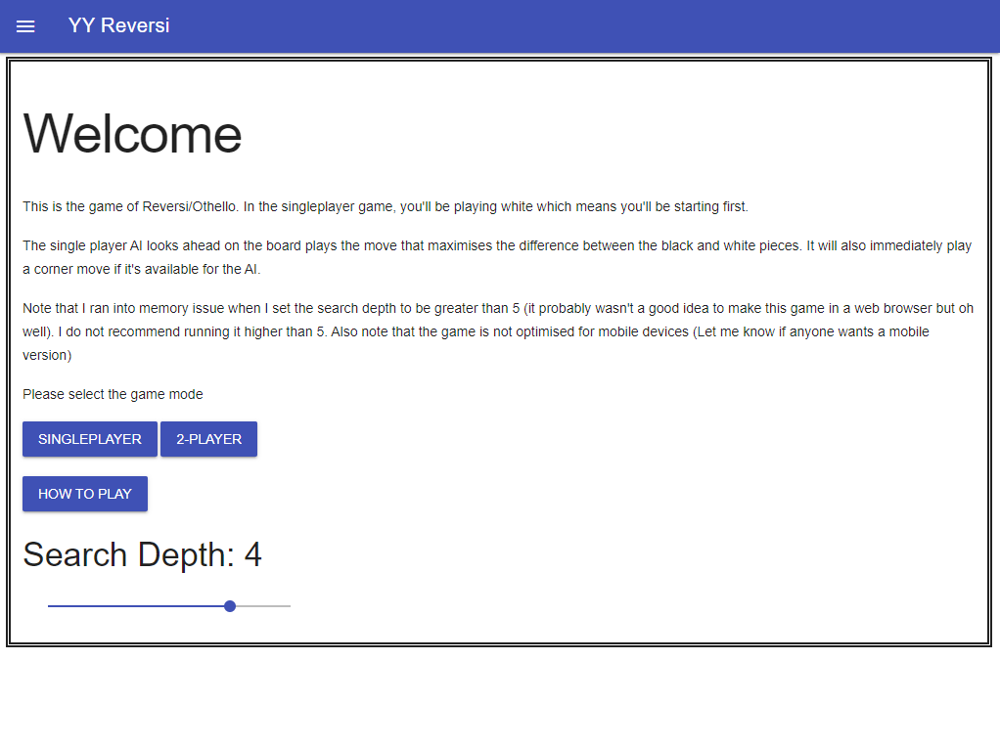
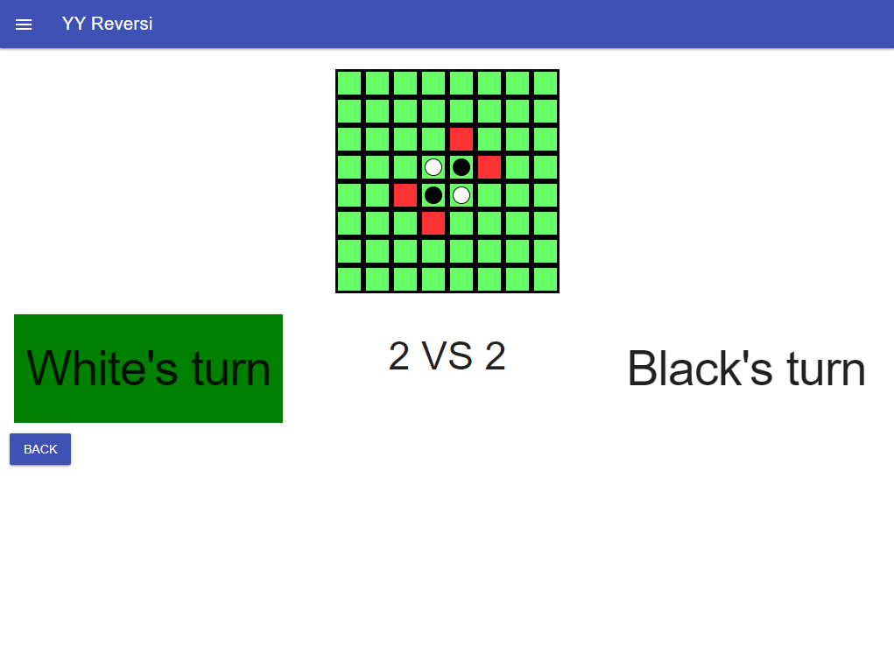

# Reversi Game

## Introduction
This is created just to see if I can turn reversi (which is one of my assignment question) in Python into JavaScript and HTML for better visualisation. This was before I knew how to code in Pygame (which is a better decision and I should've rewritten this whole thing in Pygame).

## Website link
This game is hosted on Netlify.  
[Link to the game](https://pyyi-reversi.netlify.app)

## Screenshots

